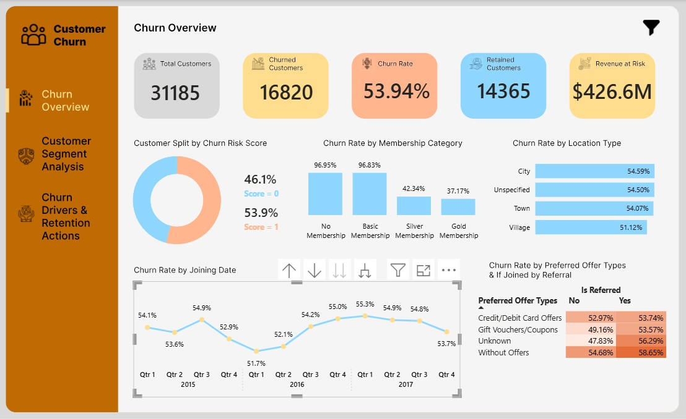
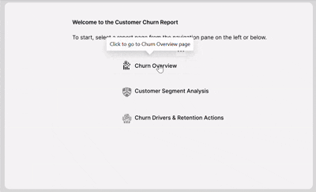

# Customer Churn Analysis — Power BI Report

An interactive 3-page Power BI dashboard identifying churn drivers and retention priorities for a fictional e-commerce company's customer base (~31K customers post-cleaning).



> 🎥 **Demo GIF:** Report interactivity (page navigation, filter pane, slicers) isn't fully conveyed by static screenshots. A short walkthrough GIF/video is introduced below
>  

## Table of Contents
- [Business Problem](#business-problem)
- [Live Report](#live-report)
- [Dataset](#dataset)
- [Data Cleaning & ETL](#data-cleaning--etl)
- [Report Pages](#report-pages)
- [Selected DAX Measures](#selected-dax-measures)
- [Key Insights](#key-insights)
- [Recommendations](#recommendations)
- [Skills Demonstrated](#skills-demonstrated)
- [Repository Structure](#repository-structure)
- [Data Source & License](#data-source--license)

## Business Problem
Senior Leadership wants to know the scale of customer churn, the main drivers behind it, and what actions should be taken to mitigate it.

## Live Report
🔗 **[Open the interactive report (Power BI Service)](https://app.powerbi.com/view?r=eyJrIjoiYWUyODhmN2MtNTkzOC00OWNhLTg4MDAtODQxYjNiZDc1ODJhIiwidCI6ImYzMjRiOTAyLWZmNGEtNDM5ZC1iYjJmLWJhMDZkODJkYzUzMyJ9&pageName=74e7d9876a5047985ef4)**

> ⚠️ This is embedded via a temporary organizational Power BI Service account and may not remain available indefinitely. The screenshots above/below and the local `.pbix` file in [`pbix/`](pbix/) are the permanent record of this project.

To explore it locally instead: open [`pbix/customer_churn.pbix`](pbix/customer_churn.pbix) in Power BI Desktop.

## Dataset
- **Source:** [Kaggle — Predict the Churn Risk Rate](https://www.kaggle.com/datasets/undersc0re/predict-the-churn-risk-rate)
- **File:** [`data/WA_Fn-UseC_-Telco-Customer-Churn.csv`](data/WA_Fn-UseC_-Telco-Customer-Churn.csv)
- **Size:** ~33,000 raw records, cleaned down to **31,185** during ETL (16,820 churned / 14,365 retained)

<details>
<summary><strong>Full data dictionary (23 columns)</strong></summary>

| Column | Description | Type |
|---|---|---|
| customer_id | Unique identification number of a customer | Text |
| Name | Name of a customer | Text |
| age | Age of a customer | Integer |
| security_no | Unique security number identifying a person | Text |
| region_category | Region a customer belongs to | Text |
| membership_category | Membership category a customer is using | Text |
| joining_date | Date a customer became a member | Date |
| joined_through_referral | Whether a customer joined using a referral code/ID | Text |
| referral_id | Referral ID | Text |
| preferred_offer_types | Type of offer a customer prefers | Text |
| medium_of_operation | Medium of operation a customer uses for transactions | Text |
| internet_option | Type of internet service a customer uses | Text |
| last_visit_time | Last time a customer visited the website | Time |
| days_since_last_login | Days since a customer last logged in | Integer |
| avg_time_spent | Average time spent by a customer on the website | Float |
| avg_transaction_value | Average transaction value of a customer | Float |
| avg_frequency_login_days | No. of times a customer has logged in | Float |
| points_in_wallet | Points awarded to a customer per transaction | Float |
| used_special_discount | Whether a customer uses special discounts offered | Text |
| offer_application_preference | Whether a customer prefers offers | Text |
| past_complaint | Whether a customer has raised any complaints | Text |
| complaint_status | Whether a raised complaint was resolved | Text |
| feedback | Feedback provided by a customer | Text |
| churn_risk_score | Churn risk score (0 or 1) | Integer |

</details>

## Data Cleaning & ETL
Performed in Power Query prior to loading into the data model. Objective: standardize missing/invalid values, apply consistent business labels, and remove records that would distort the analysis.

- **region_category** — nulls replaced with `"Unspecified"` so customers without a recorded location stayed analyzable as their own category
- **joined_through_referral** — `"?"` values resolved by checking `referral_id`: real ID → `"Yes"`, placeholder (`xxxxxxxx`) → `"No"`
- **preferred_offer_types** — blanks replaced with `"Unknown"` to retain those customers rather than drop them
- **medium_of_operation** — `"?"` replaced with `"Different"` to separate unclassified channels from known ones
- **days_since_last_login** — invalid `-999` replaced with `0` (treated as logged in same day)
- **avg_time_spent** — negative values removed (not meaningful) → **1,719 rows removed**
- **avg_frequency_login_days** — `"Error"` text values removed (non-numeric) → **520 rows removed**
- **points_in_wallet** — nulls replaced with `0`

## Report Pages

**Page 1 — Churn Overview**
KPI cards (Total / Churned / Retained Customers, Churn Rate, Revenue at Risk), churn split donut, and churn rate broken down by membership category, location type, joining date trend, and a matrix of offer type × referral status.

**Page 2 — Customer Segment Analysis**
Highest-churn membership category and region cards, referral vs. non-referral churn comparison, membership share by churn risk, churn rate by age group/gender, internet option, medium of operation, and an offer-preference × discount-usage matrix with conditional formatting.

**Page 3 — Churn Drivers & Retention Actions**
Behavioral drivers among churned customers (avg. days since last login, avg. time on site, complaint rate), high-value-customers-at-risk count, transaction value distribution (min/25th/median/75th/max), churn rate by complaint status, and a prioritized retention table with conditional formatting flagging the customers most worth contacting first.

**All pages** — left-side page navigation buttons, a bookmark-driven show/hide filter pane, and dropdown slicers for Membership Category, Location Type, Age Group, and Gender.

<details>
<summary><strong>Full visual-by-visual breakdown</strong></summary>

| Page | Visual | Type |
|---|---|---|
| 1 | Total Customers | Card |
| 1 | Churned Customers | Card |
| 1 | Churn Rate | Card |
| 1 | Retained Customers | Card |
| 1 | Revenue at Risk | Card |
| 1 | Customer Split by Churn Risk Score | Donut chart |
| 1 | Churn Rate by Membership Category | Clustered column chart |
| 1 | Churn Rate by Location Type | Clustered bar chart |
| 1 | Churn Rate by Joining Date | Line chart |
| 1 | Churn Rate by Preferred Offer Types & Referral Status | Matrix, conditional formatting |
| 2 | Highest Churn Membership Category | Card |
| 2 | Highest Churn Location Type | Card |
| 2 | Churn Rate among Referral Customers | Card |
| 2 | Churn Rate among Non-Referral Customers | Card |
| 2 | Share of Customers in Membership Categories by Churn Risk | 100% stacked column |
| 2 | Number of Customers by Location Type and Churn Risk | Clustered bar chart |
| 2 | Churn Rate by Age Group and Gender | Clustered column chart |
| 2 | Churn Rate by Internet Option | Clustered bar chart |
| 2 | Churn Rate by Medium of Operation | Clustered bar chart |
| 2 | Churn Rate by Offer Preference and Special Discount Usage | Matrix, conditional formatting |
| 3 | Average Days Since Last Login (Churned) | Card |
| 3 | Average Time Spent on Website (Churned) | Card |
| 3 | Complaint Rate among Churned Customers | Card |
| 3 | High-Value Customers at Risk | Card |
| 3 | Average Transaction Value Distribution | 5 cards as table w/ data bars (min/25th/median/75th/max) |
| 3 | Churn Rate by Complaint Status | Clustered bar chart |
| 3 | Average Time Spent — Retained vs. Churned | Clustered column chart |
| 3 | Retention Table — Prioritized List of Customers to Contact | Table, conditional formatting |

</details>

## Selected DAX Measures

```DAX
Churn Rate =
DIVIDE(
    [Churned Customers],
    [Total Customers]
)
```

```DAX
Revenue at Risk =
CALCULATE(
    SUM(churn[avg_transaction_value]),
    churn[churn_risk_score] = 1
)
```

```DAX
Highest Churn Membership Category =
MAXX(
    FILTER(
        VALUES(churn[membership_category]),
        [Membership Churn Rank] = 1
    ),
    churn[membership_category]
)
```

```DAX
High-Value Customers at Risk =
CALCULATE(
    DISTINCTCOUNT(churn[customer_id]),
    churn[churn_risk_score] = 1,
    churn[avg_transaction_value] > 1.5 * AVERAGE(churn[avg_transaction_value])
)
```

Full measure list (30+, including the ranking helper measures and BLANK-safe referral rate calculations) is documented in [`docs/Documentation.docx`](docs/Documentation.docx).

## Key Insights
- **31,185 customers** analyzed: **16,820 churned**, **14,365 retained** → overall **churn rate of 53.94%**
- Strong relationship between membership tier and retention: **Silver — 42.34%**, **Gold — 37.17%** churn, vs. **No Membership — 96.95%** and **Basic — 96.83%**
- Location, age group, and gender are meaningfully weaker churn differentiators than membership category
- Referral acquisition alone doesn't produce more loyal customers (**55.31%** churn among referred vs. **52.2%** among non-referred)
- Churned customers spent an average of **288 minutes** on the site vs. **297 minutes** for retained — a modest 9-minute engagement gap
- **~50.07%** of churned customers had previously filed a complaint
- **2,118 high-value customers** identified as at-risk (avg. transaction value > 1.5× the overall average)
- Transaction value is widely distributed (median **USD 27.39K**, 75th percentile **USD 40.73K**, max **USD 99.9K**) — a small group of high-value customers likely accounts for a disproportionate share of revenue at risk
- The retention table surfaces customers combining multiple warning signals: high transaction value, **21 days since last login**, unresolved complaints, poor feedback, and churn risk = 1

## Recommendations

1. **Prioritize No-Membership and Basic-Membership customers** — both segments sit near a 97% churn rate.
   - Introduce an onboarding journey for customers without membership
   - Offer a time-limited upgrade to Silver
   - Communicate paid membership benefits more clearly
   - Provide loyalty points or targeted incentives after initial transactions
   - Reassess whether Basic Membership offers enough value over having none

2. **Treat the 2,118 high-value at-risk customers as the top intervention group** — retaining them protects more revenue than an equivalent effort spread across the full churn population. Prioritize by transaction value, days since last login, unresolved complaints, negative feedback, and churn risk score. Interventions: personalized outreach, priority support, account reviews, loyalty rewards, targeted retention offers.

3. **Improve complaint resolution quality** — ~50% of churned customers had a prior complaint. Prioritize unresolved cases (especially from high-value and inactive customers), add post-resolution follow-ups, and measure complaint handling by resolution time and repeat-complaint/retention outcomes, not just case closure.

## Skills Demonstrated
- **Power Query** — null handling, conditional replacement logic, invalid-value removal, ETL documentation
- **DAX** — `CALCULATE`, `DIVIDE`, `MAXX`/`FILTER` ranking patterns, `BLANK()`-safe ratio measures, dynamic multi-condition filters
- **Data modeling** — single fact table (`churn`) supporting cross-page reuse of core measures
- **Report design** — bookmark-driven filter pane, page navigation buttons, conditional formatting, cross-page slicer consistency
- **Publishing** — Power BI Service embed/share configuration
- **Insight communication** — translating measures into a prioritized, action-oriented business recommendation set

## Repository Structure
```
customer_churn_powerbi/
├── assets/
│   ├── canvas/          # background/design SVGs used in the report
│   ├── screenshots/     # static page previews
│   └── demo/            # walkthrough GIF
├── data/                # source CSV
├── docs/                # full documentation (this README's source)
├── pbix/                # Power BI file
├── LICENSE
└── README.md
```

## Data Source & License
- Dataset: [Kaggle — Predict the Churn Risk Rate](https://www.kaggle.com/datasets/undersc0re/predict-the-churn-risk-rate). Refer to the Kaggle listing for the dataset's own usage terms.
- Project code, report design, and documentation in this repository: [MIT License](LICENSE).
